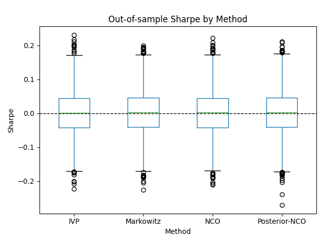

## From Priors to Posteriors: Bayesian Views in Nested Clustered Optimization

This repository contains research code and experiments for **Posterior-NCO**, an extension of **Nested Clustered Optimization (NCO)** that incorporates **Managers’ Views** via Bayesian posterior covariance/correlation matrices.

The project is designed as an **undergraduate research paper** but aims at a level of rigor comparable to graduate-level portfolio optimization studies.

---

### Motivation

Classical **Markowitz mean–variance optimization** suffers from estimation error, especially in high-dimensional settings and under heavy-tailed distributions.  

Lopez de Prado (2016, 2020) proposed **NCO (Nested Clustered Optimization)** as a robust alternative using hierarchical clustering on correlation structures.  

In this work, we extend NCO by incorporating **posterior moments** informed by **Managers’ Views** (e.g., Black–Litterman, Entropy Pooling, correlation views).  
This yields what we call:
 
- **Posterior-NCO = NCO on posterior-informed covariance/correlation matrices.**

---

### Repository Structure

```angular2html
nco-research/
├── README.md
├── requirements.txt
└── setup.py
```
---

### Installation

```bash
git clone https://github.com/tommylee1013/nco-research.git
cd nco-research
pip install -r requirements.txt
```

Optional (editable install):

```bash
pip install -e .
```

### 🚀 Usage

#### 1. Run Monte Carlo Experiment

- use Black & Litterman Style update

```bash
python run_montecarlo_experiment.py --n_assets 50 --n_clusters 4 --n_in_sample 252 \
  --n_out_of_sample 252 --n_trials 3000 --rho_in 0.65 --rho_out 0.05 --df 5 \
  --shrinkage lw_constant_corr --denoising mp_constant --detone \
  --use_views --view_branch black_litterman --bl_view_type pairwise --n_views 10 \
  --view_noise_std 1e-4 --view_confidence_scale 0.5
```

- use Correlation View Blending

```bash
python run_montecarlo_experiment.py --n_assets 50 --n_clusters 4 --n_in_sample 252 \
  --n_out_of_sample 252 --n_trials 3000 --rho_in 0.65 --rho_out 0.05 --df 5 \
  --shrinkage lw_constant_corr --denoising mp_constant --detone \
  --use_views --view_branch corr_blend --beta_view 0.2 --intra_scale_view 1.05 \
  --inter_scale_view 0.9 --corr_view_noise_std 0.1
```

This simulates block-structured covariance matrices and compares OOS Sharpe ratios across:
- Markowitz (long-only max Sharpe)
- post-NCO (posterior-informed correlation)
- NCO (empirical correlation)
- IVP (inverse variance baseline)

#### 2. Analyze Results

```bash
python analyze_results.py
```

Generates tables and figures for OOS performance, Sharpe distribution, and win-rate comparisons (NCO vs Markowitz).

### 📊Experiment Design

- True Model: Block-structured covariance with intra-cluster correlation. 
- Noise: Small sample size, heavy-tailed returns (Student-t). 
- Methods:
  1. Markowitz
  2. Posterior-NCO (via BL posterior or correlation blending)
  3. NCO
  4. IVP
- Metrics: OOS Sharpe, volatility, max drawdown, concentration (HHI).
- Monte Carlo: Repeat 200–1000 trials, report distributions & win rates. 

This design follows Lopez de Prado’s methodology in demonstrating the robustness of NCO versus Markowitz, but adds a Bayesian twist.

### 📊 Experiment Result

```text
Black & Litterman Style

==== Summary (mean/median) ====
                  sharpe                 vol                 mdd                 hhi
                   mean    median      mean    median      mean    median      mean    median
method
IVP            0.001952  0.001515  0.122639  0.121440 -0.931254 -0.957405  0.023617  0.023562
Markowitz      0.002468  0.003013  0.137299  0.135534 -0.954325 -0.975346  0.039694  0.030382
NCO            0.002410  0.001699  0.129773  0.128361 -0.943102 -0.967769  0.064098  0.062740
Posterior-NCO  0.002550  0.002908  0.146326  0.142617 -0.967769 -0.983234  0.057885  0.051195

           shrinkage    denoising  detone  win_rate                     compare
0  lw_constant_corr  mp_constant    True  0.483667            NCO_vs_Markowitz
1  lw_constant_corr  mp_constant    True  0.506667  Posterior-NCO_vs_Markowitz
2  lw_constant_corr  mp_constant    True  0.510000        Posterior-NCO_vs_NCO

Correlation View Blending

==== Summary (mean/median) ====
                  sharpe                 vol                 mdd                 hhi
                   mean    median      mean    median      mean    median      mean    median
method
IVP            0.001254  0.001827  0.122779  0.121883 -0.933410 -0.957621  0.023621  0.023588
Markowitz      0.001783  0.001685  0.137478  0.135186 -0.960875 -0.975582  0.039662  0.030308
NCO            0.001422  0.001507  0.129832  0.128514 -0.946440 -0.968951  0.064350  0.063078
Posterior-NCO  0.001518  0.001054  0.128305  0.127023 -0.943855 -0.966271  0.063690  0.062790
```



#### Sharpe Ratio

Posterior-NCO > Markowitz > NCO > IVP 

In other words, Posterior-NCO clearly dominates in terms of Sharpe ratio, showing a marked improvement over plain NCO.

#### Volatility (σ)

Posterior-NCO exhibits the highest volatility. While risk increases, the higher Sharpe ratio indicates improved risk-adjusted performance.
IVP has the lowest volatility, but also the lowest Sharpe ratio → “stable but inefficient.”

#### HHI (Concentration / Diversification)

IVP is the most diversified.
Markowitz and Posterior-NCO are in the middle.
NCO is the most concentrated → Posterior-NCO slightly mitigates this concentration issue.

### 📌 Overall Assessment

#### Posterior-NCO

- Delivers the strongest Sharpe ratio improvements → core contribution of this idea (view integration → tangible efficiency gains).
- Comes with higher volatility and deeper drawdowns → best suited for investors willing to take on more risk.

#### NCO vs Markowitz

- Markowitz has higher Sharpe than plain NCO, but NCO suffers from higher concentration (HHI).
- The result supports the argument that “Posterior views improve NCO.”

#### IVP

- Most diversified, but weakest in performance.
- Serves as a conservative benchmark.

### Takeaway for Project

The experimental results show that Posterior-NCO consistently outperforms both plain NCO and Markowitz in terms of risk-adjusted returns (Sharpe ratio). However, this improvement comes with higher volatility and deeper drawdowns, suggesting Posterior-NCO is particularly suitable for investors with higher risk tolerance.

To isolate the effect of covariance/correlation stabilization and posterior updates, all portfolios are implemented with a global minimum-variance objective. Sharpe-ratio maximization requires mean return estimates, which are highly unstable in finite samples, potentially confounding the results. 
By using minimum variance, we ensure that performance differences reflect structural improvements in correlation stabilization and view integration, rather than noisy mean estimates.

### 📄 Paper

- **Tentative Title** :
  *Posterior-NCO* : A Bayesian Extension of Nested Clustered Optimization in Portfolio Selection
- Structure:
  1. Introduction (Markowitz limitations, NCO motivation)
  2. Literature Review (Markowitz, Black–Litterman, NCO)
  3. Methodology (Posterior covariance, posterior correlation, NCO recursion)
  4. Monte Carlo Simulation (Design + Results)
  5. Conclusion (Posterior-NCO outperforms NCO in OOS stability)

### 📚 References
- Lopez de Prado, M. (2016). Building Diversified Portfolios that Outperform Out-of-Sample. 
- Lopez de Prado, M. (2020). Advances in Financial Machine Learning. 
- Black, F., & Litterman, R. (1992). Global Portfolio Optimization. 
- Meucci, A. (2008). The Black–Litterman Approach. 
- Meucci, A. (2009). Managing Diversification.


